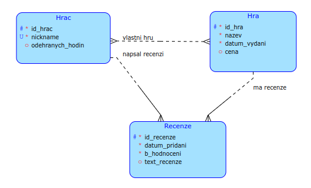

# TJV Semestrální práce - Scream
## Základní informace
Tento projekt vznikl jako semestrální práce na předmět Technologie Java (BI-TJV) v ZS 2023/2024 na FIT ČVUT.

## Téma projektu, popis
Scream je nejstrašidelnější platforma na internetu, zaměřena zajména na hororové hry.
Nabízí širokou sbírku her, ze kterých vám bude běhat mráz po zádech a potit se vám dlaně. Tohle není žádné hraní pro děcka.

Platforma poskytuje hráčům možnost hodnotit hry, které hráli, a zanechávat recenze, které obsahují bodové hodnocení jednotlivých aspektů hry a textové hodnocení, popisující například jak jak děsivá byla nebo jak moc hráče bavila. Tyto recenze si mohou prohlédnout ostatní uživatelé a mohou být ostatním hráčům užitečná při rozhodování, kterou hru si zahrají příště. 

V tomhle projektu se zaměřuji nejvíce právě na tu část ohledně hráčských recenzí.

## Datový model

### Popis vazeb
- **Hráč-Hra** *M:N*
    * Hráč může vlastnit libovolné množství her, hru může vlastnit více hráčů
- **Hráč-Recenze** *1:N*
    * Hráč může napsat recenzi k libovolné hře (pouze jednu), hra může mít více recenzí od hráčů, každá recenze patří ke konkrétnímu hráči
- **Hra-Recenze** *1:N*
    * Hra může mít více recenzí od různých hráčů, ke každé recenzi patří hra

## Dotaz
Chceme vypočítat každý měsíc pro každou hru její průměrné hodnocení na základě všech recenzí, které tato hra během této doby obdržela.

* Sestavíme žebříček nejlépe hodnocených her v daném období

## Komplexní non-CRUD operace
Jelikož je pro nás zážitek naších hráčů to nejdůležitější, mohli bychom (komplexní operace je tedy:)
  * Zlevnit ty nejlepší hororové hry v daném období (provede administrátor)

## Použité technologie
### Backend
* Java 17
* Spring Boot 3.1.5
* Spring Security
* H2 Database / PostgreSQL
* Gradle
* JWT (JSON Web Token)

### Frontend
* Thymeleaf
* Bootstrap
* Font Awesome

## JWT API autorizace
Aplikace používá JWT pro autentizaci hráčů. Pro přístup k některým API endpointům je potřeba se nejdříve přihlásit pomocí POST requestu na `/api/auth/login` s uživatelským jménem a heslem. V odpovědi je pak token, který je potřeba přidat do hlavičky každého dalšího requestu, který vyžaduje přihlášení. Token se přidá do hlavičky jako `Authorization: Bearer <token>`.

## Sestavení a spuštění
Jsou dvě možnosti jak aplikaci sestavit, buďto přímo pomocí Gradle nebo do Docker kontejneru.

### Gradle
Pro sestavení aplikace pomocí Gradle je potřeba mít nainstalovaný Gradle a JDK 17. Poté stačí spustit příkaz:
```shell
gradle build
```
nebo s použitím Wrapperu:
```shell
./gradlew build
```

Poté je možné aplikaci spustit pomocí příkazu:
```shell
java -jar build/libs/tjv_semestral_work-1.0.0-SNAPSHOT.jar
```

### Docker
Pro sestavení aplikace do Docker kontejneru je potřeba mít nainstalovaný Docker. Poté stačí spustit příkaz:
```shell
docker build -t scream .
```

Poté je možné aplikaci spustit pomocí příkazu:
```shell
docker run -p 8080:8080 -e DATABASE_URL=your_database_url -e DATABASE_USERNAME=your_username -e DATABASE_PASSWORD=your_password scream
```

V obou případech je aplikace dostupná na adrese http://localhost:8080 a
REST api na adrese http://localhost:8080/api/.

### Docker compose
Je možné také použít docker compose, který automaticky spustí aplikaci a databázi.
Stačí spustit příkaz v kořenovém adresáři projektu:
```shell
docker compose up
```

### Databáze
Ve výchozím nastavení aplikace používá databázi H2, která je uložena v paměti a po restartu aplikace se vymaže.
Je možné použít databázi PostgreSQL, potom je potřeba změnit nastavení v souboru `application.properties`. Stačí pouze odkomentovat řádek pod komentářem PostgreSQL, případně upravit přístupové údaje.

V Docker containeru je potom možné nastavit připojení k databázi pomocí proměnných prostředí, například:
* DATABASE_URL=jdbc:postgresql://localhost:5432/scream
* DATABASE_USERNAME=postgres
* DATABASE_PASSWORD=postgres

## Demo
**Update 4/2024:** Aplikace byla nasazená pouze pár týdnů v rámci hodnocení semestrální práce, poté jsem cloud nasazení musel zrušit z důvodu ceny.

~~Aplikaci jsem na vyzkoušení nahrál na cloud, je dostupná na adrese https://scream.svobodao.cz a REST api na adrese https://scream.svobodao.cz/api/.~~

~~Pro nasazení jsem použil Microsoft Azure, kde je aplikace nasazení pomocí Docker Container App a databáze PostgreSQL.~~

### Admin účet
Do aplikace by se měl automaticky přidat při spuštění uživatel "admin" s heslem "admin", který bude mít práva vytvářet nové hry (na webu přistupovat do "Admin dashboard"). Funkčnost přidání admin práv jinému uživateli není implementovaná, došel čas.


## OpenAPI dokumentace
Dokumentace REST API je dostupná na adrese http://localhost:8080/swagger-ui.html
nebo https://scream.svobodao.cz/swagger-ui.html.
